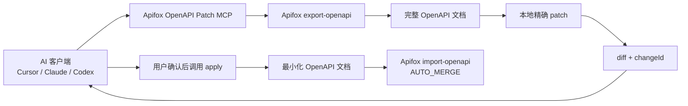

# Apifox OpenAPI Patch MCP：让 AI 安全修改接口文档

> 截图占位：这里可以放一张 Cursor 或其他 MCP 客户端成功加载 Apifox MCP 的截图。

## 背景

接口文档的日常维护通常不是一次性重写，而是大量小改动：给接口增加一个 query 参数、给请求体补一个字段、把响应字段标成必填、给 schema 加描述。直接让 AI 调完整 OpenAPI 导入接口有两个问题：

1. AI 很容易把“单接口小改动”扩大成“整份文档重写”。
2. 写入动作如果没有预览和确认，风险不可控。

这个项目的设计目标是把 Apifox 的 OpenAPI 导入导出能力包装成一个 MCP 服务，让 AI 客户端可以先读取、搜索、预览，再由用户确认后写回。核心原则是：**preview-first，apply-after-confirmation**。

## 一句话原理

MCP 客户端调用本服务的工具后，服务先从 Apifox 导出 OpenAPI，在本地内存中对目标接口做精确 patch，生成 diff 和 `changeId`；只有再次调用 `apifox_apply_change` 时，才把一个最小化 OpenAPI 文档通过 Apifox `import-openapi` 写回。

## 整体架构



服务本身由 `@modelcontextprotocol/sdk` 实现。启动后会创建 `McpServer`，自动扫描并注册 `tools/*.js` 模块，然后根据 `APIFOX_MCP_TRANSPORT` 选择 stdio 或 HTTP 传输。

## 启动流程

1. `src/index.ts` 调用 `boot()`。
2. `src/server/boot.ts` 创建 `McpServer`。
3. `autoRegisterModules(server)` 扫描并注册工具模块。
4. 如果 `APIFOX_MCP_TRANSPORT=stdio`，服务通过标准输入输出和客户端通信。
5. 如果 `APIFOX_MCP_TRANSPORT=http`，服务启动 Express，并在 `/mcp` 暴露 Streamable HTTP MCP endpoint。

常用模式是 stdio，因为 Cursor、Claude Desktop 等本地 MCP 客户端通常直接拉起 Node 进程。

## 工具分层

### 只读工具

这些工具会访问 Apifox，但不会修改数据：

| 工具 | 用途 |
| --- | --- |
| `apifox_search_endpoints` | 按 path、method、keyword 搜索接口 |
| `apifox_get_endpoint` | 读取指定 path/method 的接口定义 |
| `apifox_export_openapi` | 按 scope 导出 OpenAPI |

### 预览工具

这些工具会导出 OpenAPI，在本地生成变更预览，但不会写回 Apifox：

| 工具 | 用途 |
| --- | --- |
| `apifox_preview_request_param_change` | 新增或更新请求参数 |
| `apifox_preview_request_body_field_change` | 新增或更新请求体 schema 字段 |
| `apifox_preview_response_field_change` | 新增或更新响应 schema 字段 |

预览工具返回：

```json
{
  "changeId": "0f3f7d9e-xxxx-xxxx-xxxx",
  "summary": "added query parameter pageSize on GET /users",
  "diff": "--- before\n+++ after\n..."
}
```

### 确认工具

| 工具 | 用途 |
| --- | --- |
| `apifox_apply_change` | 根据 `changeId` 写回 Apifox |
| `apifox_discard_change` | 丢弃未应用的 pending change |

## Preview 到 Apply 的真实链路

以给请求参数增加字段为例：

1. AI 调用 `apifox_preview_request_param_change`。
2. MCP 读取 `APIFOX_ACCESS_TOKEN`、`APIFOX_PROJECT_ID`、`APIFOX_BRANCH_ID`、`APIFOX_MODULE_ID` 等配置。
3. MCP 调 Apifox `/v1/projects/{projectId}/export-openapi`。
4. MCP 在本地找到目标 `paths[path][method]`。
5. MCP 修改 operation 的 `parameters`。
6. MCP 基于 before/after 生成 diff。
7. MCP 构造只包含目标接口和必要 components 的最小 OpenAPI 文档。
8. MCP 把这份最小文档放进进程内 pending store，生成 `changeId`。
9. 用户确认后，AI 调用 `apifox_apply_change`。
10. MCP 读取 pending change，通过 `/v1/projects/{projectId}/import-openapi` 写回。
11. 写回成功后，MCP 删除这个 pending change。

> 截图占位：这里可以放一张 preview 返回 diff 和 changeId 的截图。

## 为什么要生成最小 OpenAPI 文档

Apifox 的 OpenAPI 导入是项目级或模块级能力。如果直接把完整导出的 OpenAPI 再导回去，影响面比较大，也不利于审查。

所以这个 MCP 在 apply 时不会导入整份 OpenAPI，而是构造一份最小文档：

```json
{
  "openapi": "3.1.0",
  "info": {
    "title": "原文档标题",
    "version": "原文档版本"
  },
  "paths": {
    "/users": {
      "get": {
        "...": "只保留目标 operation"
      }
    }
  },
  "components": {
    "schemas": {
      "User": {
        "...": "只保留目标 operation 依赖的 schema"
      }
    }
  }
}
```

导入时使用 Apifox 的自动合并策略：

- `endpointOverwriteBehavior: "AUTO_MERGE"`
- `schemaOverwriteBehavior: "AUTO_MERGE"`
- `deleteUnmatchedResources: false`

这样可以把写入范围控制在目标接口及其必要引用上，避免误删未匹配资源。

## 安装和配置

先构建项目：

```bash
npm install
npm run build
```

Cursor 或其他 MCP 客户端可以使用 stdio 配置：

```json
{
  "mcpServers": {
    "Apifox": {
      "command": "node",
      "args": ["/path/to/apifox-mcp/build"],
      "env": {
        "APIFOX_ACCESS_TOKEN": "<access-token>",
        "APIFOX_PROJECT_ID": "<project-id>",
        "APIFOX_MCP_TRANSPORT": "stdio"
      }
    }
  }
}
```

> 截图占位：这里可以放 Cursor MCP 配置页面或配置文件截图。

可选环境变量：

| 环境变量 | 说明 |
| --- | --- |
| `APIFOX_API_BASE_URL` | Apifox API 地址，默认 `https://api.apifox.com` |
| `APIFOX_BRANCH_ID` | 限定 Apifox 分支 |
| `APIFOX_MODULE_ID` | 限定 Apifox 模块 |
| `APIFOX_TIMEOUT_MS` | API 超时时间，默认 `15000` |
| `APIFOX_MCP_TRANSPORT` | `stdio` 或 `http`，默认 `stdio` |
| `APIFOX_MCP_HOST` | HTTP 模式绑定地址 |
| `APIFOX_MCP_HTTP_BEARER_TOKEN` | HTTP 模式的 Bearer Token |
| `CORS_ORIGIN` | HTTP 模式 CORS origin |
| `PORT` | HTTP 模式端口 |

## 使用实例 1：给接口新增 query 参数

需求：给 `GET /users` 新增 query 参数 `pageSize`，类型 `integer`，默认值 `20`，非必填。

推荐先让 AI 搜索接口：

```text
帮我在 Apifox 里找到 GET /users 接口，先不要修改。
```

AI 应调用：

```json
{
  "tool": "apifox_search_endpoints",
  "arguments": {
    "path": "/users",
    "method": "get"
  }
}
```

确认接口后，再预览修改：

```text
给 GET /users 增加 query 参数 pageSize，integer 类型，默认值 20，非必填，说明是每页数量。先预览 diff，不要应用。
```

对应工具参数：

```json
{
  "path": "/users",
  "method": "get",
  "location": "query",
  "name": "pageSize",
  "required": false,
  "description": "每页数量",
  "schema": {
    "type": "integer",
    "default": 20,
    "minimum": 1,
    "maximum": 100
  }
}
```

确认 diff 后再说：

```text
确认，应用刚才的 changeId。
```

AI 应调用：

```json
{
  "tool": "apifox_apply_change",
  "arguments": {
    "changeId": "预览返回的 changeId"
  }
}
```

## 使用实例 2：给请求体增加嵌套字段

需求：给 `POST /users` 的 JSON 请求体增加 `profile.nickname` 字段，类型 `string`，非必填。

```json
{
  "path": "/users",
  "method": "post",
  "contentType": "application/json",
  "fieldPath": "profile.nickname",
  "required": false,
  "schema": {
    "type": "string",
    "description": "用户昵称",
    "maxLength": 50
  }
}
```

调用工具：

```text
apifox_preview_request_body_field_change
```

这个工具会解析 `fieldPath`，如果中间对象不存在，会在 schema 中补出 object 结构；如果字段已存在，则会更新该字段 schema。

## 使用实例 3：给响应体增加字段

需求：给 `GET /users/{userId}` 的 `200` 响应增加 `profile.avatarUrl`，类型 `string`，格式 `uri`。

```json
{
  "path": "/users/{userId}",
  "method": "get",
  "status": "200",
  "contentType": "application/json",
  "fieldPath": "profile.avatarUrl",
  "required": false,
  "schema": {
    "type": "string",
    "format": "uri",
    "description": "头像 URL"
  }
}
```

调用工具：

```text
apifox_preview_response_field_change
```

确认 diff 后，再调用 `apifox_apply_change`。

## 使用实例 4：把字段改为必填或非必填

把 `POST /orders` 请求体中的 `buyerPhone` 改为必填：

```json
{
  "path": "/orders",
  "method": "post",
  "contentType": "application/json",
  "fieldPath": "buyerPhone",
  "required": true,
  "schema": {
    "type": "string",
    "description": "购买人手机号",
    "pattern": "^1[3-9]\\d{9}$"
  }
}
```

把 `remark` 改为非必填：

```json
{
  "path": "/orders",
  "method": "post",
  "contentType": "application/json",
  "fieldPath": "remark",
  "required": false,
  "schema": {
    "type": "string",
    "description": "订单备注"
  }
}
```

实现上，`required: true` 会把字段加入 schema 的 `required` 数组；`required: false` 会从 `required` 数组移除该字段。

## 使用规范

### 1. 修改前必须先定位接口

优先使用：

```text
apifox_search_endpoints
apifox_get_endpoint
```

不要只凭自然语言里的接口名直接改。尤其是同一路径存在多个 method，或者同名接口分布在多个模块时，必须确认 `path + method`。

### 2. 修改类操作必须先 preview

推荐对 AI 明确说：

```text
先预览 diff，不要直接应用。
```

这个 MCP 的设计已经保证 preview 工具不会写回，但 prompt 里明确要求可以减少误触 `apply` 的概率。

### 3. 必须审查 diff 后再 apply

确认下面几项：

- path 是否正确
- method 是否正确
- request body / response status 是否正确
- `contentType` 是否正确
- schema 类型、描述、默认值是否符合预期
- required 变化是否符合预期

> 截图占位：这里可以放 diff 审查截图。

### 4. 不确定就 discard

如果 diff 不符合预期，调用：

```text
apifox_discard_change
```

然后重新 search、get endpoint、preview。不要在错误的 `changeId` 上继续 apply。

### 5. 注意 changeId 的生命周期

`changeId` 保存在 MCP 进程内存中。服务重启、客户端重启或进程退出后，旧的 `changeId` 可能失效。看到：

```json
{
  "applied": false,
  "error": "Pending change not found. Run preview again."
}
```

说明需要重新 preview。

### 6. 分支和模块要通过环境变量固定

如果项目使用 Apifox 分支或模块，建议在 MCP 配置里显式设置：

```json
{
  "APIFOX_BRANCH_ID": "123",
  "APIFOX_MODULE_ID": "456"
}
```

这样每次 export/import 都会走同一范围，避免 AI 在默认项目范围里误查或误改。

### 7. HTTP 模式不要裸露到公网

HTTP 模式主要用于调试或远程集成。若绑定到非本机地址，必须设置：

```bash
APIFOX_MCP_HTTP_BEARER_TOKEN=<strong-token>
```

同时限制网络访问范围。普通本地使用优先选择 stdio。

## 推荐 Prompt 模板

搜索接口：

```text
请使用 Apifox MCP 搜索接口，关键词是「用户列表」。只返回候选 path、method、summary，不要修改。
```

预览请求参数变更：

```text
请在 Apifox 中给 GET /users 增加 query 参数 pageSize，integer 类型，默认值 20，非必填，说明是“每页数量”。先调用 preview 工具返回 diff 和 changeId，不要 apply。
```

预览请求体字段变更：

```text
请在 Apifox 中给 POST /users 的 application/json 请求体增加 profile.nickname 字段，string 类型，最大长度 50，非必填。先读取接口确认 schema，再预览 diff，不要 apply。
```

应用变更：

```text
我已确认 diff，应用 changeId 为 <changeId> 的变更。
```

放弃变更：

```text
这个 diff 不符合预期，请丢弃 changeId 为 <changeId> 的变更，不要写回 Apifox。
```

## 常见问题

### Cursor 提示 Some tools have naming issues and may be filtered out

Cursor 会把 MCP server 名和 tool 名组合后做长度校验。配置里的 server key 建议使用短名，例如：

```json
{
  "mcpServers": {
    "Apifox": {}
  }
}
```

不要用太长的名字，例如 `Apifox OpenAPI Patch`，否则和 `apifox_preview_request_body_field_change` 组合后可能触发过滤警告。

### 为什么 preview 也要导出整个 OpenAPI

因为 patch 需要知道目标接口当前结构，以及它引用的 schema。导出完整 OpenAPI 后，本地才能准确生成 before/after diff，并在 apply 前构造最小 OpenAPI 文档。

### 为什么不是直接调用 Apifox 的字段级 API

当前实现基于 Apifox 的 OpenAPI 导入导出能力。它不依赖私有字段级接口，兼容性更清晰，也更容易审计。代价是每次 preview 都需要先 export OpenAPI。

### 会不会删除其他接口

正常不会。apply 导入时使用 `deleteUnmatchedResources: false`，并且导入的是最小 OpenAPI 文档，不是整份文档。

但仍然必须审查 diff，特别是当目标 operation 引用了共享 schema 时，schema 合并可能影响同一个组件的其他引用方。

## 总结

这个 MCP 的关键价值不是“让 AI 能写接口文档”，而是给 AI 写接口文档加上边界：

- 先读接口，再修改。
- 先生成 diff，再写回。
- 只导入最小 OpenAPI 文档。
- 使用 Apifox 自动合并，避免删除未匹配资源。
- 通过 `changeId` 把 preview 和 apply 拆成两个明确步骤。

后续如果要继续增强，可以考虑把 pending change 持久化、给 diff 增加更结构化的展示、支持更多 OpenAPI patch 类型，以及在 apply 前增加二次校验。
